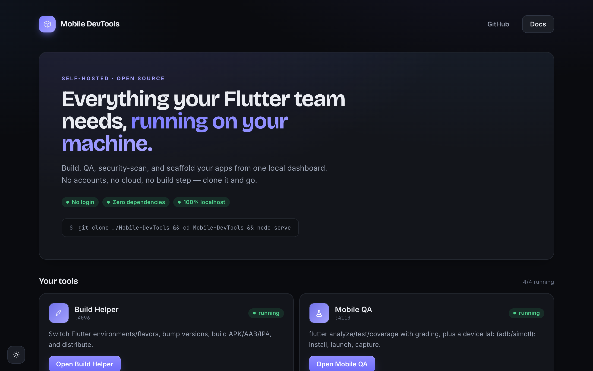
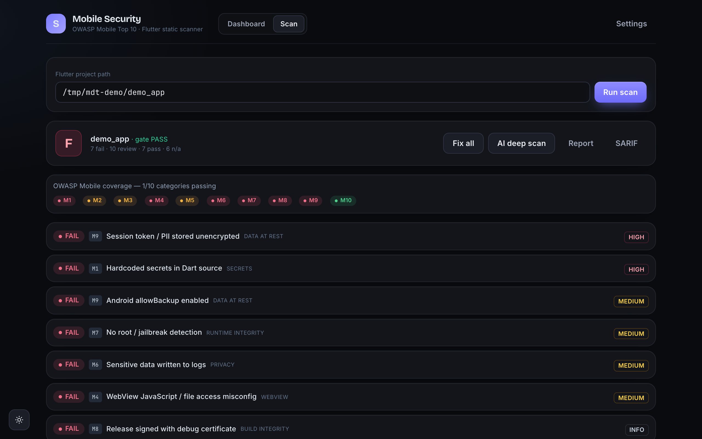
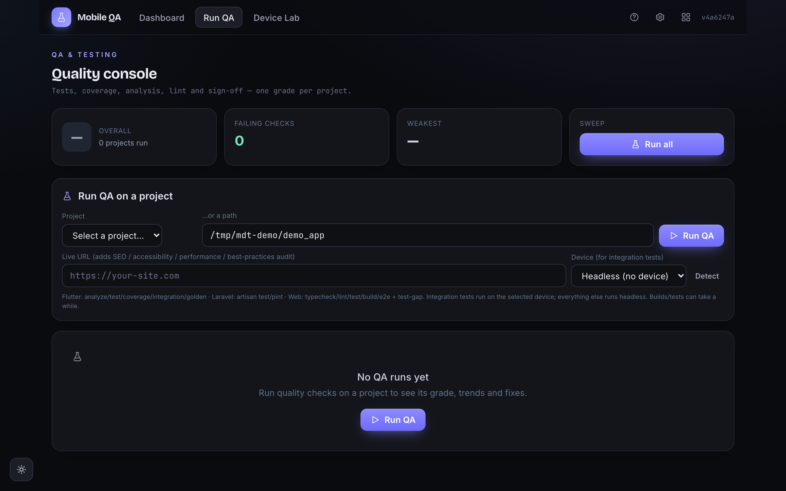
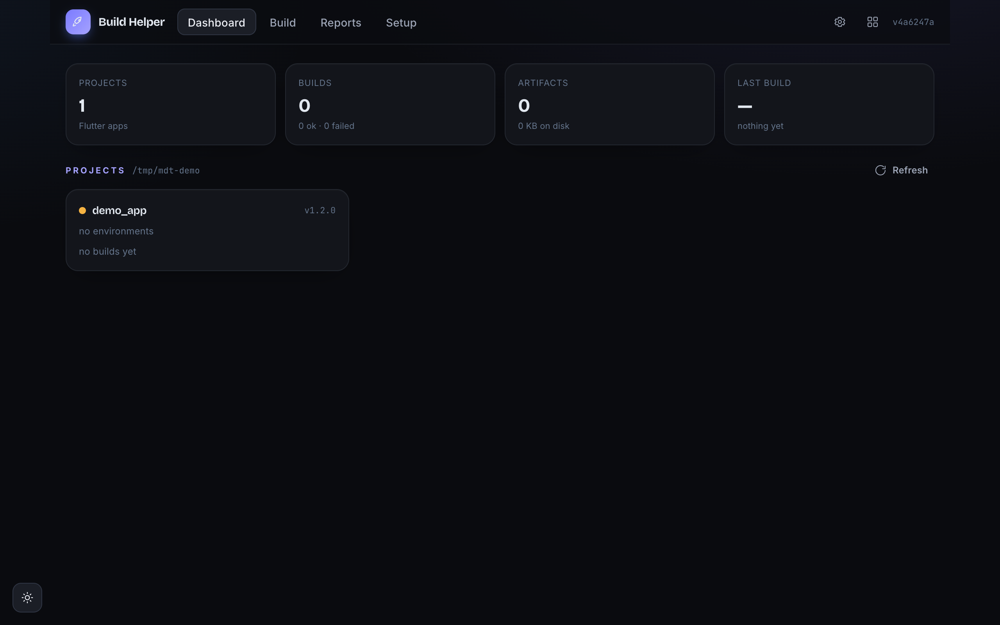
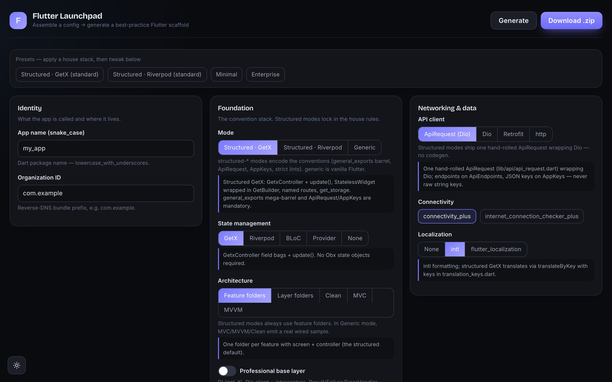

<div align="center">

# Mobile DevTools

**A zero-dependency, self-hosted toolkit for Flutter mobile teams.**
Build, QA, security-scan, and scaffold your apps — all from one local dashboard.
No accounts. No cloud. No build step.

</div>

---

Mobile DevTools is a small platform of four focused tools that run entirely on
your own machine. Clone it, run `node serve`, and open the dashboard. Everything
works on `localhost` against your local Flutter toolchain and devices — nothing
is uploaded anywhere, and there is no login.

## The four tools

| Tool | What it does |
|------|--------------|
| 🚀 **Build Helper** | Switch Flutter environments/flavors, bump versions, build APK/AAB/IPA, and distribute to Firebase, TestFlight, Play, or your own storage. |
| 🧪 **Mobile QA** | Run `flutter analyze`/`test`/coverage with a grading engine, plus a Device Lab: install & launch on a device/simulator, capture screenshots, video, and logs. |
| 🛡️ **Mobile Security** | OWASP Mobile Top 10 scanning for Flutter apps — findings, grading, quality gate, SBOM, CVE lookup, and git-secret detection. |
| 🧱 **Flutter Launchpad** | Assemble a project config in the UI and generate a complete, best-practice Flutter project scaffold you can download as a zip or hand to Build Helper. |

## Screenshots

Everything runs locally in a dark, no-login dashboard. `node serve` opens the hub,
which links to the four tools:

<p align="center">
  
</p>

<table>
  <tr>
    <td width="50%"><b>🛡️ Mobile Security</b> — OWASP Mobile Top 10 scan: grade, quality gate, and findings with one-click fixes.</td>
    <td width="50%"><b>🧪 Mobile QA</b> — a quality console: analyze / test / coverage runners, one grade per project.</td>
  </tr>
  <tr>
    <td></td>
    <td></td>
  </tr>
  <tr>
    <td width="50%"><b>🚀 Build Helper</b> — dashboard for environments, builds (APK/AAB/IPA) and distribution.</td>
    <td width="50%"><b>🧱 Flutter Launchpad</b> — assemble a config and generate a best-practice Flutter scaffold.</td>
  </tr>
  <tr>
    <td></td>
    <td></td>
  </tr>
</table>

## Quick start

```sh
# Requires Node.js >= 20 and the Flutter SDK on your PATH.
git clone https://github.com/battastudio/Mobile-DevTools.git
cd Mobile-DevTools
node serve
```

Then open **http://localhost:4090**. That's it — no install, no `npm install`,
no accounts.

## Why zero-dependency?

Every tool here uses only the Node.js standard library. There is no bundler, no
`node_modules`, and no build step. It stays fast to clone, trivial to audit, and
impossible to break with a bad transitive dependency. See
[`CONTRIBUTING.md`](./CONTRIBUTING.md) for the full engineering rules (including
the 150-lines-per-file cap).

## Documentation

Full docs — a getting-started guide, per-tool walkthroughs, and feature
deep-dives — are published at
**<https://battastudio.github.io/Mobile-DevTools-Docs/>**. They're built with
Astro Starlight and live in their own repo:
[battastudio/Mobile-DevTools-Docs](https://github.com/battastudio/Mobile-DevTools-Docs).

## Requirements

- **Node.js ≥ 20**
- **Flutter SDK** on your `PATH`
- For device features: **Android platform-tools (`adb`)** and/or **Xcode
  (`simctl`)**
- macOS or Linux (Windows/WSL support is planned)

## License

[MIT](./LICENSE) © Batta Studio
