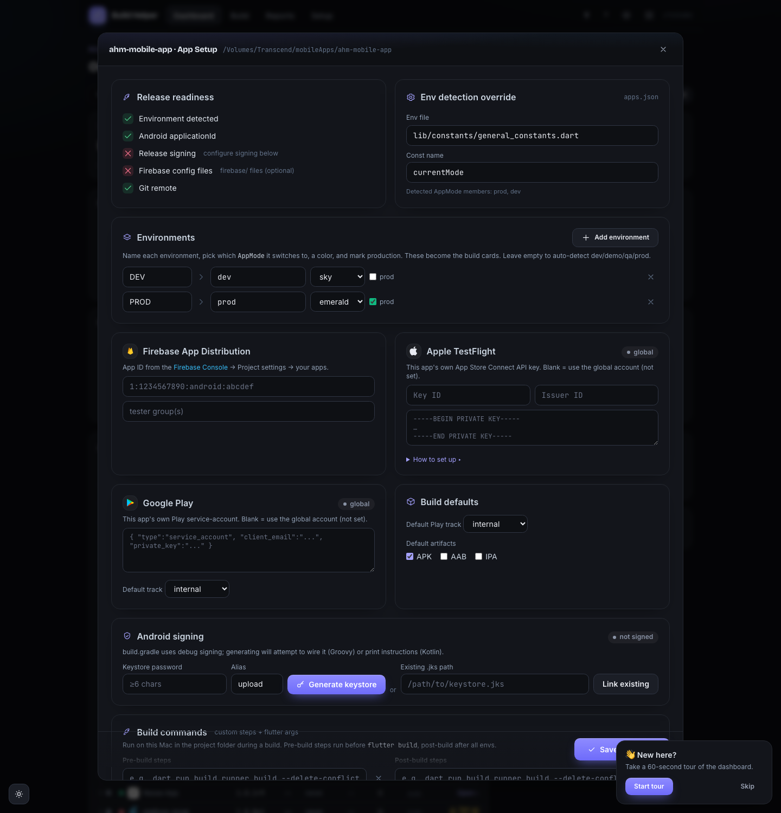

This page lists everything Build Helper does. Each feature explains what it is
and how you use it.

## App detection

**What it does.** Build Helper scans your projects root for folders that have a
`pubspec.yaml` and a `lib/` directory, and lists each as an app on the
dashboard. For every app it reads the version from `pubspec.yaml` and works out
its environments: it finds the `AppMode` constant the app actually compiles
against, the file that defines it, and the `enum AppMode { ... }` members, then
maps them to the logical environments **dev / demo / qa / prod** (it treats
`production` as `prod`).

**How to use it.** Drop your Flutter projects under `~/mobileApps` (or set
`FLUTTER_PROJECTS`) and they appear automatically. If an app shows **needs
setup — no env detected**, the `AppMode` constant or its defining file was
ambiguous — set the constant name, env file, and environments as a per-app
override so detection succeeds.

## Environment switching

**What it does.** Selecting an environment for a build rewrites the app's
`AppMode` constant to the matching enum member in its env file. If the file has a
`viewLog` flag, it's set `false` for production and `true` otherwise. If the app
has a `firebase/` folder with the expected config files, the dev/prod
`google-services.json` and `GoogleService-Info.plist` are copied into place for
the selected environment.

**How to use it.** On the Build screen, tick the environment(s) you want. The
switch happens automatically at the start of the build — you don't run it
separately.

## Flavors and per-app build options

**What it does.** Per app, Build Helper can pass a Gradle/Xcode **flavor**
(`--flavor <name>`), extra `flutter build` arguments, and **pre-build** and
**post-build** shell commands that run around the build. Post-build commands get
the app name, repo, environments, and version as environment variables
(`BH_APP`, `BH_REPO`, `BH_ENVS`, `BH_VERSION`).

**How to use it.** These come from an app's saved settings (flavor, build args,
pre/post commands). Set them once and every build for that app uses them.

## Version bump

**What it does.** For each environment it writes `version: <name>+<number>` into
`pubspec.yaml`. When you build an **IPA** it also patches the iOS project so the
archive picks up the right version: `MARKETING_VERSION` and
`CURRENT_PROJECT_VERSION` in the Xcode project, any literal versions in
`Info.plist`, the `App.framework` `MinimumOSVersion`, and it declares export
compliance (`ITSAppUsesNonExemptEncryption = false`) so TestFlight builds aren't
stuck on "Missing Compliance".

**How to use it.** Set the **version name** and **build number** per environment
on the Build screen. Use the **M / m / p** buttons to bump major / minor / patch,
or tick **auto** to let the build pick the next unused number for that
environment (the max of the pubspec number and every number you've built before,
plus one).

## Builds

**What it does.** Runs `flutter build apk | appbundle | ipa --release` for each
artifact you pick, in each environment you pick, one at a time. Only one build
runs at a time across the whole tool. The full pipeline per run is: optional
branch checkout → optional `clean` / `pub get` / `analyze` / `test` → pre-build
commands → then per environment: switch → write version → build → distribute →
record → post-build commands → security scan.

**How to use it.** Pick artifacts (**APK / AAB / IPA**) and options, then click
**Build**. Watch the **Live log**; use **Stop** to cancel. Each built artifact is
renamed to `<app>-<env>-<version>+<number>.<ext>`, copied into Build Helper's
artifacts folder, and served over your LAN for install.

## Build gates and the Advanced menu

**What it does.** The **Advanced** menu on the Build screen holds the optional
steps that run around the artifact build:

- **flutter clean** and **pub get** run as preparation.
- **analyze** runs `flutter analyze`; **test** runs `flutter test` — each fails
  the build unless **gate: warn only** is ticked.
- **git commit + tag** commits the version bump and tags it; **git push** pushes.
- **validate IPA** runs a TestFlight validation pass; **upload crash symbols**
  sends iOS dSYMs to Crashlytics.

A **branch selector** lets you check out a branch before building.

## Build guards

**What it does.** After you press Build but before any long work, Build Helper
checks four things and shows an **inline prompt** if any fails:

- **Version too low (TestFlight)** — App Store Connect already has an equal or
  higher marketing version than the IPA you're uploading. Offers **Use `<next
  patch>`** (which fills the suggested version) or **Build anyway**.
- **Duplicate build number** — the build number was already used for that
  environment.
- **Dirty tree** — the repo has uncommitted changes (it lists them).
- **Production publish** — you're sending a production build to a store or the
  production track; it asks you to **Publish anyway**.

**How to use it.** Fix what it names, or use the prompt's **Build anyway** /
**Use `<version>`** button to override just that guard and re-run.

## Distribution targets

Each environment card on the Build screen has its own **outputs matrix** — tick
where that env's build should go:

| Output | Where it goes |
|----------|---------------|
| **OneDrive** | Every built artifact → your OneDrive folder |
| **Firebase** | APK (or AAB) → Firebase App Distribution testers |
| **Play** (+ track) | AAB → Google Play, on the selected track |
| **TestFlight** | IPA → TestFlight |

Leave them all unticked to build locally without uploading. Setup for each
channel is covered in
[Signing & distribution](/Mobile-DevTools/build-helper/signing-and-distribution/).

### OneDrive

Uploads artifacts with **rclone**, using *your own* rclone config — Build Helper
never ships or fetches a shared account. Files land under
`<remote>:<base>/<repo>/<env>/`, and it fetches a share link for each file and the
folder when it can.

### Firebase App Distribution

Uses the **Firebase CLI** to distribute an APK (preferred) or AAB to your
configured testers/groups, with the release notes attached. When an IPA is built
it can also upload iOS **dSYMs** to Crashlytics.

### Google Play

Uploads the AAB through the Google Play Developer API using a service-account
key, rolls it out to a track (**internal / alpha / beta / production**), and can
upload the ProGuard `mapping.txt` for crash deobfuscation. Release notes are set
on the release.

### TestFlight

Uploads the IPA with `xcrun altool` using your App Store Connect API key, with an
optional validation pass first. Afterward it sets export compliance and the "What
to Test" notes automatically, and logs a TestFlight install link. It gives clear
errors when the version is too low or the build number was already used.

## Rollback and retry uploads

**What it does.** Two post-build actions that don't require rebuilding:

- **Rollback** — re-promote an already-uploaded Google Play version code to a
  track (channel change or roll back).
- **Retry upload** — re-run a single upload target (OneDrive, Play, TestFlight,
  or Firebase) for a past build, reusing the stored artifact.

**How to use it.** These act on a recorded build; the build must still have its
artifact on disk (retry) or a stored Play version code (rollback).

## Build detail and history

**What it does.** Clicking a build in **Recent builds** opens its **detail**:
metadata (build number, branch, commit link, duration, author), the recorded
upload statuses, and each artifact with **Download**, **Copy path**, and
per-artifact **re-upload to any target** (OneDrive / Firebase / Play /
TestFlight). It also offers **Re-apply TestFlight notes** (re-runs the export
compliance + "What to Test" pass) and, when a Play version code is stored,
**Play rollback**. The history list supports **multi-select bulk re-upload** —
tick several builds, pick a target, and re-push them all.

**How to use it.** Open a build for its detail, or tick rows in the history and
use the bulk **Re-upload** bar.

## Share a build

**What it does.** From a finished build (summary card, history, or detail) the
**Share** action opens a branded **build card** drawn on a canvas — app name,
version, environment, distribution targets, and a QR that points at the LAN
install page. From there you can **Download PNG** or **Copy image**, **Copy team
text** or **Copy client text**, **Email client groups** (recipients ride BCC),
and **Create a Jira release** ("Mobile Release" work item with the card attached
and referenced issues linked).

**How to use it.** Click **Share**, then the button you want. Email uses the
client groups set in App Setup; the Jira release uses the app's tracker config.

## App Setup (per app)

**What it does.** A per-app modal (from the dashboard **Set up** action or the
build header **App Setup** button) — one scrolling page with sections for:

- **Overview** — a release-readiness checklist (env, signing, package id, icon,
  Firebase App ID, Apple/Play, OneDrive) and the Android signing shortcut.
- **Environments** — override the `AppMode` const name and env file, and define
  **custom environments** (key · label · AppMode member · color · prod).
- **Accounts** — Firebase App ID, and per-app Apple / Google Play credentials.
- **Build** — flavor, extra build args, and pre-/post-build shell commands.
- **Schedule** — unattended **scheduled builds** (env · time · days · artifacts).
- **Trackers** — per-app issue-tracker credentials that override the shared ones.
- **Groups** — this app's client email groups (used when emailing a build).

## Scheduled builds

**What it does.** A scheduler tick runs every minute and fires any per-app
schedule whose day and time match now. Scheduled builds are **build-only** (no
distribution) and bypass the interactive guards, since no one is watching to
answer a prompt.

**How to use it.** Add schedules in **App Setup → Schedule**. Keep Build Helper
(or the hub) running for them to fire.

## Version and self-update

**What it does.** The nav **⬆** button shows the current version, how many
commits you're behind the remote, and this tool's recent changelog. **Update
now** runs `git pull --ff-only`; restart Build Helper (or the hub) to apply the
new code.

## Release notes and issue trackers

**What it does.** For each release, Build Helper collects the commits since the
last build of that environment, extracts issue keys (Jira and other configured
trackers), enriches them, and appends them to the release notes it sends to your
distribution channels. It can also group commits by conventional-commit type
(feat / fix / …) into a tidy "What's new", and create a Jira "Mobile Release"
work item.

**How to use it.** Each environment card has a **release-notes** box with fill
buttons — **Template**, **Commits** (grouped conventional commits), and **Tasks**
(commit-scraped tracker items) — plus a **Jira** button that opens a picker to
search existing issues, tick the ones to attach, or create a new one. Configure
trackers in the shared **⚙** settings gear; per-app overrides (in App Setup)
take precedence over the global ones.

## Git commit, tag, and changelog

**What it does.** A release can commit the version change, tag it
(`<app>-v<version>`), and optionally push. It maintains a local per-app changelog
(`<app>.md`) with each version's notes, and links commit hashes back to
GitHub/GitLab/Bitbucket.

## Dashboard, KPIs, and charts

**What it does.** The dashboard shows four KPI tiles — **Projects**, **Builds**
(ok / failed), **Artifacts** (file count and total size on disk), and **Last
build** — driven by **range / project / env** filters, alongside hand-rolled
**SVG charts**: builds over time (stacked ok/failed), average build duration,
upload health per target, and builds by environment. Below sits a
**project-health table**: one row per app with its health dot, environment
chips, version, last build, build count, a **security grade** (pulled
best-effort from the Mobile Security tool), a **favorite** ★ toggle, and a
**Set up / Open** action. Columns are **sortable**, rows are **drag-to-reorder**
(persisted), and a **density** toggle switches compact/comfortable.

**How to use it.** Set the filters to slice the KPIs and charts. Click **Open**
(or the app name) to build; **Set up** opens App Setup for an unconfigured app.
Press **⌘K / Ctrl-K** for a quick-jump palette over projects and actions, and
the **?** in the nav starts a guided tour. Use **Refresh** to rescan.

## Reports

**What it does.** A filterable view of your build history. Filter by date range
(All time / 7 / 30 / 90 days) and environment. Export the filtered set as a
**CSV** file, or open a printable **HTML** report and use **Print / Save PDF**.

**How to use it.** Open the **Reports** tab, set the filters, and click **CSV**
or **Print / PDF**.

## LAN install page

**What it does.** Every artifact is downloadable over your local network. The
install page (`/install?path=<artifact>`) shows a QR code and a download button;
`/artifact?path=` serves the file itself, restricted to Build Helper's own
artifacts folder so a phone can't pull arbitrary files off the host. For iOS it
generates an `itms-services` manifest.

**How to use it.** Open the install page on a phone on the same Wi-Fi. Android
installs directly (allow unknown sources); iOS ad-hoc needs an HTTPS URL (see the
caution in [Usage](/Mobile-DevTools/build-helper/usage/#sharing-a-build-with-testers)).

## Android signing

**What it does.** From the **Signing** button on the Build screen you can
**generate** a release upload keystore (via `keytool`, stored in Build Helper's
git-ignored data dir) or **link** an existing `.jks`. Either way it writes
`android/key.properties` and wires `build.gradle` for release signing (keeping a
`.bak` backup). For Kotlin-DSL `build.gradle.kts` it prints the exact snippet to
paste instead of editing automatically.

**How to use it.** Click **Signing**, then **Generate** (set a key alias and a
password of 6+ characters) or paste the path to an existing keystore and click
**Link**.

## Doctor and Setup

**What it does.** The **Setup** tab has two parts:

- **Doctor** — checks Homebrew, Node, npm, git, Flutter, Xcode, CocoaPods,
  rclone, and the Firebase CLI, shows each tool's version, and reports free disk
  space. Missing tools that are safe to auto-install show an **Install** button
  (non-interactive, no `sudo`). **Run flutter doctor** streams the full
  `flutter doctor -v` report.
- **Distribution connectors** — connect **OneDrive** (rclone OAuth), or use the
  **shared team-folder** mode (connect your own account and point uploads at a
  folder an owner shared with you — add it to "My files" first, then enter its
  path); log in to the **Firebase CLI**; save your **Google Play**
  service-account JSON and default track; and save your **Apple / TestFlight**
  Key ID, Issuer ID, and `.p8`.

**How to use it.** Open **Setup**, run the Doctor, install anything missing, then
connect the channels you plan to use.

## Notifications and email

**What it does.** Build Helper can post a Slack/Telegram message on build start,
success, failure, and size regressions. It can also email a build announcement to
per-repo client groups (recipients ride BCC).

**How to use it.** Configure Slack/Telegram and email in the shared **⚙**
settings gear.

## Activity feed

**What it does.** A live, cross-tab feed of build events (start / done / error /
status) streamed over Server-Sent Events, with a short replay buffer so a tab
that reconnects catches up.

## Size-regression checks

**What it does.** After building an artifact, Build Helper compares its size to
the same artifact in the previous build of that environment. If it grew more than
15%, it logs a warning and fires a notification with the percentage.

## Post-build security scan

**What it does.** After a successful build, Build Helper asks the **Mobile
Security** tool (default `http://localhost:4110`) to scan the project and logs the
resulting grade. It's best-effort — if the Security tool isn't running, the build
still succeeds and it just notes that it was skipped.

## Storage cleanup

**What it does.** Build Helper keeps every built artifact under its data dir. A
cleanup action removes artifacts older than a chosen number of days (default 30),
optionally scoped to one project, and reports how much space it freed.
