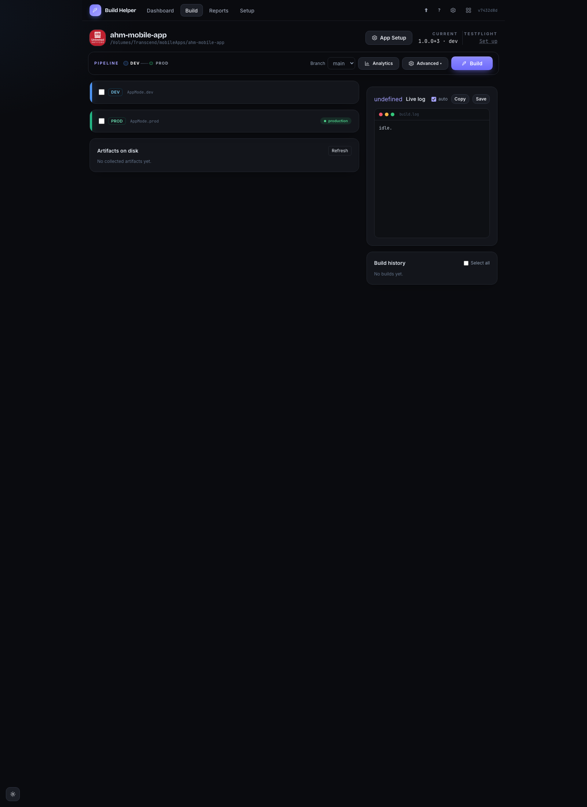

This is the full path through a build: open an app, choose its environment and
version, build the artifacts, and distribute them. It takes about a minute once
your app is detected.

## 1. Launch and open the dashboard

Start Build Helper from the hub (`node serve`, then click **Build Helper**) or
standalone (`node build-helper/server.js`), and open
**http://localhost:4095**.

The **Dashboard** shows a KPI strip (Projects, Builds, Artifacts, Last build)
with **range / project / env** filters and charts, and a **project-health
table** — one row per Flutter app with its environment chips, version, health
dot, last build, security grade, and a favorite ★. Sort by any column, drag
rows to reorder, and press **⌘K** to jump to an app or action. The nav's **?**
starts a guided tour and **⬆** shows the version / update.

:::tip
By default Build Helper looks for apps in `~/mobileApps`. Point it somewhere
else with the `FLUTTER_PROJECTS` environment variable, or set the projects root
in **Setup**. An app needs a `pubspec.yaml` and a `lib/` folder to be detected.
:::

## 2. Open a Flutter project

Click a project's **Open** (or its name) in the health table to open the **Build**
screen for that app.



At the top you'll see the app **icon**, **name** and path, an **App Setup**
button, the **Current** version + environment, and **TestFlight** status. Below
that is the **pipeline** (dev→demo→qa→prod), a **Branch** selector, **Analytics**
and **Advanced** menus, and the **Build** button.

If a project is flagged **Set up** (no env detected), Build Helper couldn't find
the app's `AppMode` environment automatically — open **App Setup** (see step 3) or
[App detection](/Mobile-DevTools/build-helper/features/#app-detection).

## 3. Choose environments and versions

Under **Environments & version**, tick the environment(s) you want to build —
`DEV`, `DEMO`, `QA`, `PROD`. Each environment has its own card with:

- **Version name** — the marketing version (defaults to the app's current
  version, for example `1.4.2`); use **M / m / p** to bump major/minor/patch.
- **Build number** — pre-filled with the next unused number, or tick **auto**.
- An **outputs** row (OneDrive / Firebase / Play + track / TestFlight) and a
  **release-notes** box with Template / Commits / Tasks fills and a **Jira**
  picker.

You can build more than one environment in a single run.

:::note
Switching to an environment rewrites the app's `AppMode` constant and swaps in
the matching Firebase config files. Building `PROD` also turns off the app's
`viewLog` flag if it has one.
:::

## 4. Pick the artifacts

Under **2 · Artifacts**, choose what to build. APK is selected by default.

| Artifact | Use it for |
|----------|-----------|
| **APK** | Android sideload / testers |
| **AAB** | Play Store bundle |
| **IPA** | iOS / TestFlight |

## 5. Set the build options

Open the **Advanced** menu for the optional steps:

- **flutter clean** / **pub get** — preparation.
- **analyze** / **test** — gates (a failure stops the build unless **gate: warn
  only** is on).
- **git commit + tag** / **git push** — commit and tag the version bump.
- **validate IPA** / **upload crash symbols** — TestFlight validation and dSYMs.

A **branch** selector lets you check out a branch before building.

## 6. Choose distribution targets

Each environment card has its own **outputs** row — tick where that env's build
should go. These need to be configured once in **Setup** / **App Setup** first
(see
[Signing & distribution](/Mobile-DevTools/build-helper/signing-and-distribution/)).

- **OneDrive** — uploads every built artifact to your OneDrive folder.
- **Firebase** — sends the APK (or AAB) to Firebase App Distribution testers.
- **Play** — sends the AAB to Google Play on the selected track.
- **TestFlight** — sends the IPA to TestFlight.

Leave them all unticked to build locally without uploading anything.

## 7. Build

Click **Build**. The **Live log** panel streams every step — environment switch,
version write, `flutter build`, uploads — as it happens. Use **Stop** to cancel a
running build.

Before any long work starts, Build Helper runs a few safety checks and will pause
if:

- the git tree has **uncommitted changes**,
- the **build number** was already used for that environment,
- you're publishing a **production** build to a store, or
- a **TestFlight** version isn't higher than what App Store Connect already has.

Each pause is an **inline prompt** — fix what it names, or click **Build anyway**
(or **Use `<version>`** for a low TestFlight version) to override just that guard
and re-run.

## 8. Check the result

When it finishes, a per-env **summary card** and the **Recent builds** list show
the version, environment, duration, and which uploads succeeded. Click a build
for its **detail** (artifacts, re-upload, TestFlight re-manage, Play rollback),
or **Share** to generate a build card, copy text, email clients, or file a Jira
release. Each build is also recorded in the dashboard KPIs and in **Reports**.

## A realistic example

You're cutting a QA build of `checkout-app` at version `1.5.0`:

1. Open **checkout-app** from the dashboard.
2. Tick **QA**, set the version name to `1.5.0`, and accept the pre-filled build
   number `41`.
3. Tick **APK** (for Firebase testers) and leave **AAB**/**IPA** off.
4. In **Advanced**, tick **analyze** and **test** so the build gates on a clean
   analysis and passing tests.
5. On the QA card's outputs row, tick **Firebase**.
6. Click **Build** and watch the log switch to QA, write `1.5.0+41`, build the
   APK, and push it to your Firebase testers.

## Sharing a build with testers

Every built artifact is served over your LAN. To install one on a phone on the
same Wi-Fi, open the install page in a browser:

```
http://<your-LAN-ip>:4095/install?path=<artifact-path>
```

It shows a QR code and a download button. On Android, open the page on the phone
and allow installing from unknown sources.

:::caution
iOS ad-hoc install (`itms-services`) requires an **HTTPS** URL and the device to
be in the provisioning profile. Over plain LAN HTTP, iOS refuses the install —
use an HTTPS tunnel, or ship the iOS build through TestFlight instead.
:::

## The command line

Build Helper is a Node server with no build step.

```bash
# Standalone (opens http://localhost:4095)
node build-helper/server.js

# CI sanity check — loads the whole route/lib graph, no server, no network
node build-helper/server.js --selftest
```

A few environment variables tune it:

| Variable | Default | What it does |
|----------|---------|--------------|
| `PORT` | `4095` | Port to listen on (moves up if it's busy). |
| `FLUTTER_PROJECTS` | `~/mobileApps` | Where the dashboard looks for apps. |
| `FLUTTER_BIN` | `flutter` | Path to the Flutter binary. |
| `RCLONE_BIN` | `rclone` | Path to rclone (used for OneDrive). |
| `ONEDRIVE_REMOTE` | `onedrive` | The rclone remote name for OneDrive. |
| `ONEDRIVE_BASE` | `Mobile apps` | The base OneDrive folder for uploads. |
